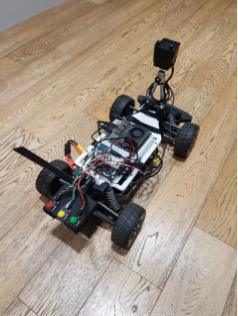
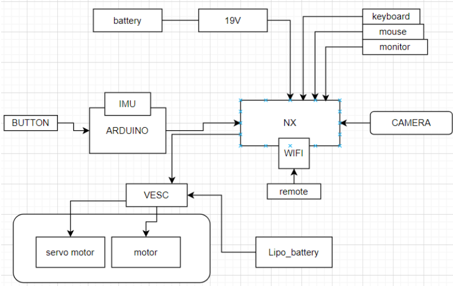
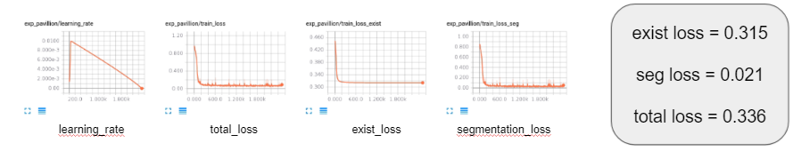

# NX

실제 모형차 제작

## HW

> https://f1tenth.org/build.html 기반( VOM)으로 제작
>
> 주요 부품
>
> - NVIDIA NX
> - ARDUINO IMU
> - CAMERA
> - RACERCAR
> - VESC
> - BUTTON
> - MOTOR ( 3 상 )

## SW

> jetpack 4.5.1
>
> python3
>
> ROS melodic
>
> - cv_bridge ( ROS noetic )
>
> pytorch 1.9.0
>
> opencv 4.1.1
>
> tensorflow 1.15

### system

> ENET - SAD 
>
> fps : 10
>
> class : 2 ( background , load )
>
> 
>
> 
>
> ENET_sad + DDPG
>
> fps : 6 ~ 7 
>
> reward : a cos theta -  b sin theta

## how to build

> **IMU data and botton signal** 
>
> arduino_ROS_button.ino
>
> https://95mkr.tistory.com/entry/ROS8
>
> *) 터미널 - arduino
>
> *) 아두이노 IDE - Tool 설정확인
> board - mbed os nano - 33 ble
> port - ACM0 (ble)
> programmer - STM~~
>
> *) 아두이노 ROS 코드 작성 또는 로드하여 보드에 업로드 후, 터미널 3개열고 각각 실행
> roscore
> rosrun rosserial_python serial_node.py _port:=/dev/ttyACM0 _baud:=57600
>
> 
>
> **ROS**
>
> Ros melodic에서 python3와 opencv4 를 사용하기 위해서 아래 과정 진행
>
> catkin_ws에서 catkin_make
>
> cvbridge_build_ws 에서 cakin build
>
> - build_cv.sh 실행
>
> 
> 
>
> **VESC** ( https://f1tenth.org/build.html )
>
> f1tenth => Install software =>  configuring the VESC
>
> 위 절차를 따름
>
> 

## exec

> 모형차 실행 확인
>
> 1. HW 연결 확인
>    모터 - VESC - NX 연결 확인
> 2. VESC, 애커만 관련 패키지 실행
>    catkin_ws에서
>    roslaunch racecar teleop.launch
>    (빨간색 에러 1줄은 조이스틱 관련이라 무시)
> 3. 동작 테스트
>    홈 디렉토리에서
>    python vesc_test1.py
>    실행
> 4. 노드 실행
>    rosrun racecar_control keyboard_teleop.py
>    (키보드 조작 노드)
>
> 모형차 실행
>
> 배쉬 파일 실행
>
> ./1vesc.sh
>
> ./2.arduino.sh
>
> ./3.camera.sh
>
> ( enet -sad 출력 ) ./4.visualize.sh
>
> ./5.ddpg.sh
>
> ( 키보드로 제어 ) ./6.keyboard.sh
>
> - w,a,d ( r : epsode 끝(reward 마이너스 ) , g : episode 실행 , y : episode 끝( reward 0 ) )

