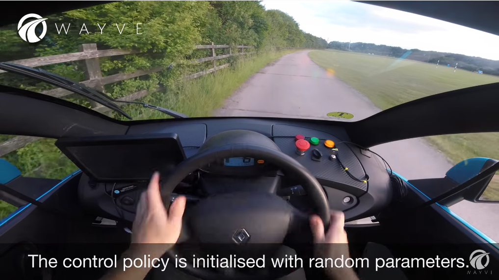
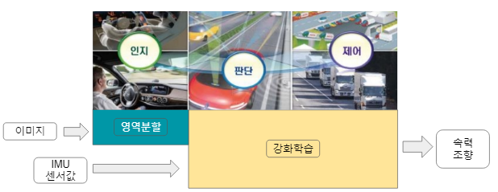
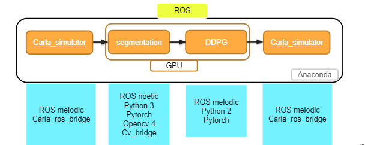
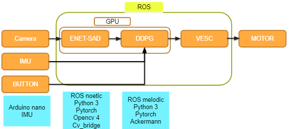
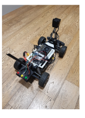
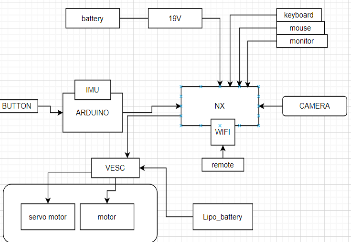
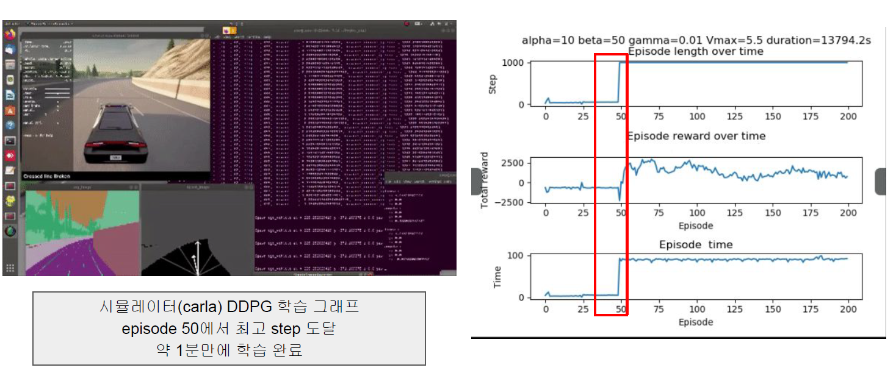

# 강화학습을 이용한 자율주행 구현

- 주요 코드는 모두 파이썬으로 이루어져있음

## 1. 개발 배경

> 
>
> https://www.youtube.com/watch?v=eRwTbRtnT1I
>
> 짧은 시간안에 학습해서 자율주행을 구현한 영상을 모토로 함.
>
> - 강화학습을 기반으로 1차로 주행을 완주함.
> - 11 episode training을 통해 학습 완료

## 2. 프로젝트 요구사항 & 목표

### 1. 프로젝트 요구사항

1. 모형차가 주행 가능한 영역 인지
2. 강화학습 모델을 활용하여 10분 내 주행

### 2. 프로젝트 목표

1. Segmentation 모델로 주행 가능한 영역 구분
2. 강화학습의 보상 설계와 입력 데이터 설계 (최적의 강화학습 조건)

## 3. 시스템 구성

### 1. 자율주행 시스템 구성

#### 1. 인공지능 모델

1. 인지 : 영역분할  segmentation ( ENET - sad )

2. 판단, 제어 : 강화학습 Reinforcelearning ( DDPG )

#### 2.  입력 데이터

1. 카메라 이미지
2. IMU 센서 데이터

#### 3. 출력 데이터

1. 속력
2. 조향

### 2. 시뮬레이터

- Carla 시뮬레이터
- Carla_ros_bridge

### 3. 모형차

- Ndivia NX 보드 기반
- Ubuntu 18.04
- 카메라, IMU 센서, 버튼, VESC, 브러쉬리스 모터

- 제작 실물

- 하드웨어 구성도

## 4. 프로젝트 결과

### 1. 인공지능 모델

1. Enet-Sad 모델을 통해 FPS 10의 실시간 영역분할 모델 적용 성공

2. 모형차에서 10분 (60 Episode) 만에 강화학습 주행 성공 

3. Gazebo, Carla 시뮬레이터에서 강화학습 적용을 통해 Reward의 최적 하이퍼 파라미터 추출 성공 (⍺=10, 𝛽=50)

### 2. Carla simulator

#### 1. Carla Simulator 설명

- 주행 가능 영역 : segmentation 영상에서 특정 픽셀인 도로와 도로가 아닌 영역을 검정색, 회색으로 구분
- 차량 진행 방향을 제시하기 위해 주행 가능 영역 내에 좌우 2점씩 찍어 주행 가능 영역의 중심을 만들고 차량이 이 중심을 쫓아가도록 함.
- 강화학습 리워드 설정은 주행 가능 영역의 중심이 차량과 일치했을 때 높은 리워드를 줌.
- 시뮬레이션은 30fps 로 추론되었으며 인공지능 모델은 강화학습인 DDPG만 사용되었음.

.gif)

### 3. NVIDIA NX 보드

.gif)

#### 1. NVIDIA NX 보드 설명

- Carla Simulator와 구동 방식은 유사하나 Segmentation 영상을 Segmentation 모델을 통해서 얻음.
- 또한 모터의 제어는 VESC를 통해서 구동한다.
- 60번의 EPISODE의 강화 학습을 거쳤고 10분이 소요됬다.
- 추론 속도가 약  8 fps로 모터의 전진 속도보다 빨라 조향 방향 치우치는 경향을 보여준다.
- 강화학습 초기 임의 조향과 속력값으로 인해 모형차가 처음 진행 할 때 한쪽 방향으로 가게 된다. 더 많은 학습을 한다면 해결  

## 5. 프로젝트 reference

### 1. AI Theory

1. segmentation model (ENET - SAD)

   https://arxiv.org/pdf/1908.00821.pdf

2. reinforce learning(DDPG)

   https://arxiv.org/pdf/1509.02971.pdf?source=post_page---------------------------

   DDPG ( autonomus driving  )

   https://arxiv.org/pdf/1811.11329.pdf

### 2. NDIVIA NX

1. NX board (jetpack 4.5.1)

   https://www.nvidia.com/ko-kr/autonomous-machines/embedded-systems/jetson-xavier-nx/

2. f1tenth를 기반으로 하드웨어가 구성되었음. (BOM 참고)

   https://f1tenth.org/

3. OS : ROS_melodic , Ubuntu 18.04

### 3. SIMULATOR

1. Carla Simulator 0.9.10.1

   https://carla.readthedocs.io/en/latest/start_quickstart/

2. OS : ROS_melodic  , Ubuntu 18.04
