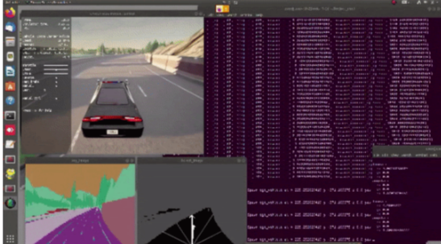

# 요구 환경
우분투 18.04
그래픽카드 Quadro RTX 4000
코어 Intel® Core™ i7
메모리 32 GiB

사용 프로그램
> 아나콘다
> ROS melodic ( full )
>
> - carla ros_bridge
> - cv_bridge
>
> carla simulator 0.9.10.1

파이썬2
- 파이토치 1.4.0
> pip install torch==1.4.0+cu100 torchvision==0.5.0+cu100 torchaudio==0.4.0 -f https://download.pytorch.org/whl/torch_stable.html
> pip install future

------

파이썬3

- 파이토치 최신버전
> pip3 install torch torchvision torchaudio

